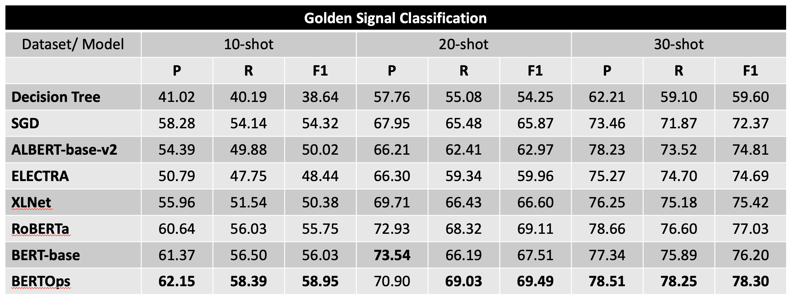

# BERTOps: Learning Representations on Logs for AIOps

## Dataset Distribution

Note: Percentage split of public vs proprietary dataset is about 0.937 % in both training and validation dataset. Below are the dataset distribution for each log source used for training BERTOps.

### Proprietary Dataset

| **Log Source** | **#Train**  | **#Validation** | **#Total**  |
|----------------|-------------|-----------------|-------------|
| Haproxy        | 5000        | 1250            | 6250        |
| MongoDB        | 120,000     | 30,000          | 150,000     |
| Apache         | 165,185     | 41,297          | 206,482     |
| Sockshop       | 86,972      | 21,743          | 108,715     |
| Robotshop      | 17,280      | 4320            | 21,600      |
| **TOTAL**      | **394,437** | **98,610**      | **493,047** |

### Public Dataset

Link to dataset: [https://zenodo.org/record/3227177#.Y5dpGi8RqJ9](https://zenodo.org/record/3227177#.Y5dpGi8RqJ9)

| **Log Source** | **#Train**     | **#Validation** | **#Total**     |
|----------------|----------------|-----------------|----------------|
| Proxifier      | 17,063         | 4266            | 21,329         |
| Linux          | 34,542         | 8636            | 43,178         |
| Zookeeper      | 59,504         | 14,876          | 74,380         |
| Thunderbird    | 80,000         | 20,000          | 100,000        |
| Mac            | 93,826         | 23,457          | 117,283        |
| OpenStack      | 166,255        | 41,564          | 207,819        |
| HPC            | 346,792        | 86,698          | 433,490        |
| Android        | 1,244,004      | 311,001         | 1,555,005      |
| BGL            | 3,798,370      | 949,593         | 4,747,963      |
| HDFS           | 8,940,503      | 2,235,126       | 11,175,629     |
| Spark          | 26,902,298     | 6,725,575       | 33,627,873     |
| **TOTAL**      | **41,683,157** | **10,420,792**  | **52,103,949** |

## Annotated Datasets

Annotated Datasets have been pushed in the `data\` folder. 

## Results

The submitted version of our paper illustrates results in terms of accuracy. We present here the results in terms of precision, recall and f1-score. Please check the `results/` folder.

## Reproducing the results

We have also pushed here, our training scripts with the appropriate hyper-parameters to prepare a pretrained model for ITOps domain. 
